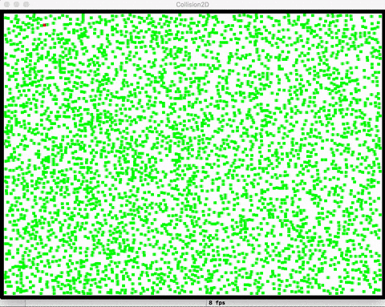
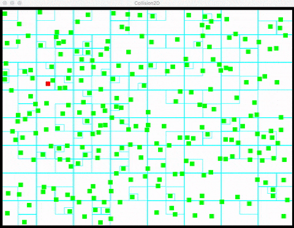

# QuadtreeCollision
A demo of collision detection using quadtree as spatial partitioning method (Demo @ NTU Game Design &amp; Research Club, 2016)

## Introduction
This is a visualized demo of the difference between Brute Force and Quadtree

Apply each of them on the same amount of particles to see the performance difference on collision detection.

## Requirements
* SDL2

## Demo
### Brute Force vs. Quadtree
4000 particles
* Brute Force: ~8 fps
* Quadtree: ~30 fps

 &nbsp; 

### Quadtree Visualization

